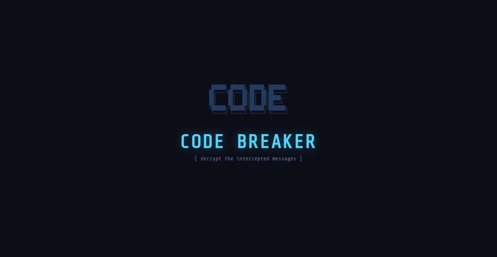

# Code Breaker

A browser-based cipher puzzle game where you intercept and decrypt encrytped messages, progressing through increasingly complex ciphers.



## [▶ Play Now](https://entryvelostition.github.io/code-breaker/)

## About

You play as a cryptanalyst who has intercepted a series of encrytped transmissions. Each level introduces a new type of cipher, from simple reverse text to Viginere and XOR. Decrypt all messages to prove your skills.

No installs, no dependencies, just open the link and play.

## Features

- 🔄 **10 cipher levels** - Reverse, Caesar, Atbash, Binary, Morse, Base64, Hex, Viginere, XOR, and a final combo challenge
- 💡 **Hint system** - stuck? use hints, but they cost you points
- ⏱️ **Score tracking** - earn points based on speed and accuracy
- 🧠 **Educational** - learn real cryptography concepts while playing

## How it works 

The game is built with vanilla HTML, CSS, and JavaScript

Each cipher has its own `encode()` function that transforms a plaintext message. The player sees only the encoded output and must figure out the original. Ciphers range from trivial (reverse the string) to non-trivial (XOR with an unknown key, where the player must deduce the key from context).

The scoring system rewards fast solves and penalizes hint usage, creating a tradeoff between speed and independence.

## Run locally 


```bash
git clone https://github.com/entryvelostition/code-breaker.git
cd code-breaker
open index.html
```

Or just open `index.html` in any browser. Thats it.

## Tech stack

- HTML5
- CSS3
- Vanilla JavaScript

**made by entryvelostition**